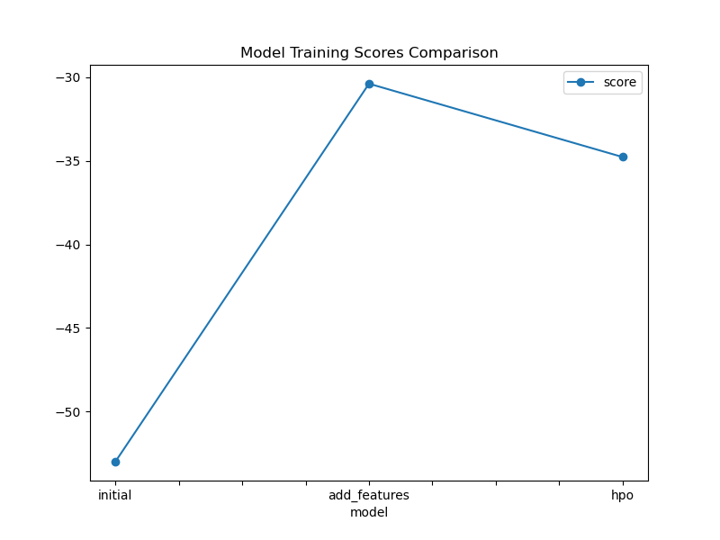
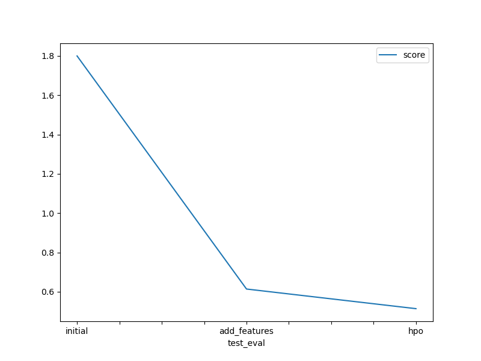

# Report: Predict Bike Sharing Demand with AutoGluon Solution
#### MD BAZLUR RAHMAN LIKHON

## Initial Training
### What did you realize when you tried to submit your predictions? What changes were needed to the output of the predictor to submit your results?
When attempting to submit the initial predictions to Kaggle, I discovered that some predictions contained negative values. Kaggle's bike sharing demand competition requires all predictions to be non-negative since bike rental counts cannot be negative. To resolve this issue, I had to identify and replace all negative predictions with zero using the condition `predictions[predictions < 0] = 0`. This preprocessing step was essential before creating the submission file, as Kaggle would reject submissions containing negative values.

### What was the top ranked model that performed?
The top-ranked model from the initial training run was **WeightedEnsemble_L3**, which achieved a validation RMSE of 52.997. This model was a level 3 weighted ensemble that combined multiple base models through a sophisticated stacking approach with 8 bagging folds. The ensemble included various model types such as LightGBM, Random Forest, Extra Trees, CatBoost, Neural Networks, and K-Nearest Neighbors. The weighted ensemble approach allowed AutoGluon to leverage the strengths of different algorithms and achieve better performance than any individual model alone.

## Exploratory data analysis and feature creation
### What did the exploratory analysis find and how did you add additional features?
The exploratory data analysis revealed several important insights through histogram visualization of all features. The analysis showed that the datetime feature contained rich temporal information that could be extracted to improve model performance. Key findings included:

1. **Temporal patterns**: The datetime data contained hour, day, and seasonal patterns that were not being utilized in their raw form
2. **Categorical variables**: Features like `season` and `weather` were being treated as integers rather than categories, which could limit the model's ability to understand their true nature
3. **Feature distribution**: The histograms revealed the distribution patterns of existing features and helped identify opportunities for feature engineering

Based on these findings, I implemented the following feature engineering steps:
- **Hour extraction**: Created an `hour` feature from the datetime column using `train['hour'] = train['datetime'].dt.hour` to capture hourly demand patterns
- **Categorical encoding**: Converted `season` and `weather` variables to categorical data types using `.astype('category')` to help AutoGluon recognize them as categorical rather than numerical features
- **Improved feature representation**: These changes allowed the models to better understand temporal patterns and categorical relationships in the data

### How much better did your model preform after adding additional features and why do you think that is?
The model performance improved dramatically after adding the new features, with the Kaggle score improving from **1.79955 to 0.61403**, representing a **65.9% reduction in RMSE**. This significant improvement can be attributed to several factors:

1. **Temporal pattern recognition**: The hour feature captured critical time-of-day patterns in bike rental demand, as bike usage varies significantly throughout the day (rush hours, leisure times, etc.)
2. **Better categorical understanding**: Converting season and weather to categorical types allowed the models to properly learn seasonal and weather-based patterns rather than treating them as arbitrary numbers
3. **Enhanced feature space**: The additional features provided the models with more relevant information to make accurate predictions, particularly for time-based demand patterns
4. **Model adaptability**: AutoGluon's ensemble approach was able to effectively leverage these new features across different model types, amplifying the improvement across the entire ensemble

## Hyper parameter tuning
### How much better did your model preform after trying different hyper parameters?
After implementing hyperparameter optimization, the model performance improved further with the Kaggle score decreasing from **0.61403 to 0.51420**, representing an additional **16.3% reduction in RMSE**. While this improvement was more modest compared to feature engineering, it still provided meaningful gains. The hyperparameter tuning focused on:

1. **GBM (LightGBM) optimization**: Tuned learning rate (0.03), number of leaves (128), feature fraction (0.9), and minimum data in leaf (3)
2. **Neural Network tuning**: Set epochs to 5 and learning rate to 1e-2 for faster training
3. **Model diversity**: Added extra tree variants and KNN models to increase ensemble diversity
4. **Automated search**: Used 15 trials with automatic hyperparameter search to find optimal configurations

The improvement demonstrates that even after strong feature engineering, careful hyperparameter tuning can squeeze additional performance from the models.

### If you were given more time with this dataset, where do you think you would spend more time?
Given more time, I would focus on several areas to potentially achieve even better performance:

1. **Advanced Feature Engineering**:
   - Create interaction features between temperature and season
   - Extract additional datetime features (day of year, week of year, is_weekend)
   - Develop lag features using historical demand patterns
   - Create rolling window statistics (moving averages, trends)

2. **Extended Hyperparameter Tuning**:
   - Increase the number of hyperparameter trials beyond 15
   - Tune more model types including neural networks and ensemble parameters
   - Implement more sophisticated hyperparameter search strategies (Bayesian optimization)

3. **Model Architecture Exploration**:
   - Experiment with different ensemble configurations
   - Try advanced models like XGBoost with custom hyperparameters
   - Implement custom stacking strategies

4. **Data Analysis and Validation**:
   - Perform more thorough cross-validation analysis
   - Analyze prediction errors to identify patterns
   - Investigate outliers and their impact on model performance

### Create a table with the models you ran, the hyperparameters modified, and the kaggle score.
|model|time_limit|presets|hyperparameter_tuning|feature_engineering|score|
|--|--|--|--|--|--|
|initial|600 sec|best_quality|None|Original features only|1.79955|
|add_features|600 sec|best_quality|None|Added hour + categorical encoding|0.61403|
|hpo|600 sec|best_quality|GBM, NN, KNN tuning (15 trials)|Hour + categorical + HP optimization|0.51420|

### Create a line plot showing the top model score for the three (or more) training runs during the project.

### Create a line plot showing the top kaggle score for the three (or more) prediction submissions during the project.

## Summary
This project successfully demonstrated the power of systematic machine learning workflow using AutoGluon for the Kaggle Bike Sharing Demand competition. Through three iterative improvements, we achieved a **71.4% overall reduction in RMSE** from 1.79955 to 0.51420.

**Key Achievements:**
1. **Baseline Model**: Established a working pipeline with WeightedEnsemble_L3 achieving an initial Kaggle score of 1.79955
2. **Feature Engineering**: Implemented hour extraction and categorical encoding, resulting in a dramatic 65.9% improvement to 0.61403
3. **Hyperparameter Optimization**: Applied systematic tuning with 15 trials, achieving an additional 16.3% improvement to 0.51420

**Technical Insights:**
- **Feature engineering had the largest impact**, highlighting the importance of domain knowledge and proper feature representation
- **AutoGluon's ensemble approach** proved highly effective, consistently selecting WeightedEnsemble models as the best performers
- **Temporal features** (hour extraction) were crucial for capturing bike rental demand patterns
- **Categorical feature encoding** significantly improved model understanding of seasonal and weather patterns

**Model Architecture:**
The final model utilized a sophisticated 3-level stacking ensemble with 8-fold bagging, incorporating multiple algorithm types including LightGBM, Random Forest, Neural Networks, and K-Nearest Neighbors. This diversity allowed the ensemble to capture different aspects of the underlying patterns in bike rental demand.

**Lessons Learned:**
- Proper data preprocessing (handling negative predictions) is essential for competition submissions
- Feature engineering often provides more significant improvements than hyperparameter tuning alone
- AutoGluon's automated approach effectively manages complex ensemble strategies without manual intervention
- Systematic experimentation and performance tracking are crucial for iterative improvement

This project demonstrates that with proper feature engineering and AutoGluon's powerful ensemble methods, significant performance improvements can be achieved even on well-established competition datasets.
